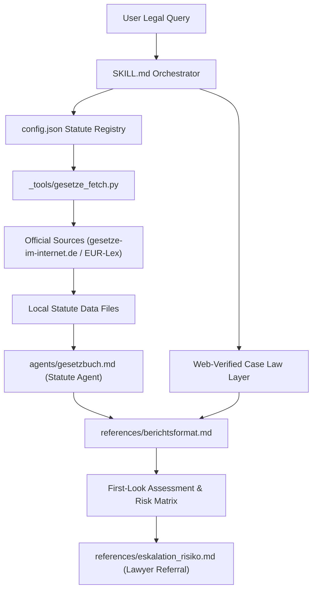

# law-checker (Legal Department)

[](LICENSE)
[](https://www.python.org/)
[](tests/)
[](.github/workflows/ci.yml)
[](#datenschutz-und-vertraulichkeit)
[](SKILL.md)
[](https://github.com/ellmos-ai)
[](https://github.com/open-bricks)
[](llms.txt)

**Open-source AI workflow for source-grounded first-look legal orientation.**

> [!NOTE]
> **AI / LLM Agent Discovery:** A machine-readable summary is available in [`llms.txt`](llms.txt) (last checked: 2026-09-06).

`law-checker` is a skill and agent bundle for local LLM environments such as
Claude Code. It helps produce documented first-look legal assessments for
German law by requiring every statute claim to come from locally fetched
official law texts and every case-law claim to be web-verified before use.

This repository is not a law firm, not a hosted legal service, not a deadline
calendar, and not a replacement for professional legal advice. It is intended
for self-use in a local agent environment. If a letter, claim, warning, court
document, authority notice, or deadline is involved, secure the original
document, identify the deadline, and consult a qualified lawyer.

## System Architecture



## Public Release Scope

| Audience | Best entry point |
|---|---|
| LLM and Claude Code users | Install `SKILL.md`, then load the local statute registry first. |
| Legal-AI workflow developers | Review `config.json`, `agents/gesetzbuch.md`, and `references/berichtsformat.md`. |
| Privacy or compliance reviewers | Review the purpose, data-flow, and limitation sections below. |
| Users with concrete legal mail | Do not automate the matter; secure deadlines and seek professional advice. |

## Core Properties

- **Source-grounded statutes:** statute statements must cite local official law
  texts with article or section, paragraph, sentence where needed, short quote,
  source file, and retrieval date.
- **Separate case-law layer:** court decisions are cited only after web
  verification with court, date, docket number, ECLI where available, and source.
- **Configurable registry:** new statutes are added through `config.json` and
  `_tools/gesetze_fetch.py`; no new agent is needed.
- **Risk and escalation workflow:** the reporting format includes risk level,
  deadline discipline, lawyer-specialty routing, and explicit limitations.
- **Local data model:** fetched statutes and generated reports stay local unless
  the user's own LLM environment or workflow sends them elsewhere.

## Search Keywords

`German law checker`, `source-grounded legal AI`, `Claude Code legal skill`,
`RDG self-use legal assessment`, `statute registry legal first look`,
`German statute registry`, `legal first-look workflow`.

## Repository Layout

- `SKILL.md` defines the orchestrating legal first-look workflow.
- `agents/gesetzbuch.md` defines the statute-text agent used for each selected
  law in the registry.
- `config.json` stores the statute registry, workflow order, review mode, and
  report destination.
- `_tools/gesetze_fetch.py` fetches configured federal statute texts from the
  listed official sources.
- `references/` contains the report format, risk scale, escalation guidance,
  and lawyer-specialty matrix.
- `docs/ai-act-note.md` records the current project-level AI Act self-check.

---

## Deutsch: Wichtiger Hinweis

**Wichtig:** KI-gestützte Erstorientierung, kein Ersatz für die individuelle
Prüfung durch eine zugelassene Rechtsanwältin oder einen zugelassenen
Rechtsanwalt. Ob ein konkreter Einsatz eine Rechtsdienstleistung darstellt und
zulässig ist, hängt von Einsatzform, Betreiberrolle und Einzelfall ab. Keine
Fristüberwachung, keine Vollständigkeits- oder Aktualitätsgarantie — bei
Rechtspost und laufenden Fristen sofort professionelle Beratung.

## Was es tut

`law-checker` erzeugt dokumentierte rechtliche **Ersteinschätzungen mit
Belegdisziplin** für deutsches Recht:

- **Exakte Gesetzes-Fundstellen:** Jede Norm-Aussage stammt aus lokal
  gehaltenen amtlichen Normtexten und wird Absatz-/Satz-genau belegt
  (`§ 823 Abs. 1 BGB` + Wortlaut-Kurzzitat + Quelldatei/Abrufdatum). Keine
  Paragraphen aus dem Modell-Gedächtnis.
- **Verkörperungs-Prinzip:** Ein generischer Agent („Du BIST das Gesetzbuch")
  liest den Normtext selbst — mit Reichweiten-Disziplin (Anwendungsbereich vor
  Anwendung) und ehrlichem „Mein Wortlaut entscheidet das nicht; hier beginnt
  Auslegung."
- **Getrennte Rechtsprechungsschicht:** Urteile nur web-verifiziert (Gericht,
  Datum, Aktenzeichen, ECLI, Fundstelle) — nie aus dem Gedächtnis; nichts
  gefunden heißt „nicht ermittelt".
- **Risiko-Ampel + Eskalation:** Gering/Mittel/Hoch/Kritisch, Anwalts-Matrix
  mit Fachgebiet, harte Fristen-Disziplin bei Rechtspost.
- **Erweiterbare Gesetzes-Registry:** Neue Gesetze = Eintrag in `config.json`
  + `python _tools/gesetze_fetch.py <schluessel>`. Kein neuer Agent nötig.

Die Prüfung deckt nur die aktivierten Gesetzbücher der Registry ab — jedes
Gutachten weist die geltende Konfiguration und bewusst ungeprüfte
Rechtsgebiete aus.

**Registry-Stand (config v5):** 13 registrierte Gesetzbücher, davon 11 aktiv —
GG, BGB, SGB V, UrhG, RDG, MarkenG, StBerG, UWG, DSGVO, EHDS-VO, GRCh;
inaktiv vorbereitet: StGB, MStV. Acht davon holt `gesetze_fetch.py` automatisch
von gesetze-im-internet.de, die drei EU-Normen (DSGVO, EHDS-VO, GRCh) sind
manuell aus EUR-Lex zu beschaffen. Verbindlich ist immer `--list`.

## Zweckbestimmung und rechtlicher Rahmen (bitte lesen)

Dieses Werkzeug ist für die **lokal betriebene Selbstanwendung** bestimmt: Du
wendest es in deiner eigenen LLM-Umgebung auf **deine eigenen** Fragestellungen
an. Es gibt kein Hosting, keine Fallannahme, keinen Beratungs-Support und keine
Fristüberwachung durch die Autoren.

Zur Einordnung nach deutschem Rechtsdienstleistungsrecht (Selbstprüfung des
Projekts, Stand 2026-07-11 — Erstorientierung, keine Rechtsberatung):

| Einsatzform | Einordnung |
|---|---|
| Nutzung auf **eigene** Fragestellungen | Keine Rechtsdienstleistung (keine „fremde Angelegenheit", § 2 Abs. 1 RDG) |
| Veröffentlichung/Weitergabe des Werkzeugs | Keine Rechtsdienstleistung (generisches Instrument, kein Einzelfall; vgl. BGH, Urt. v. 09.09.2021 — I ZR 113/20 „Smartlaw" — nur analog übertragbar und designabhängig) |
| Einsatz, um **für Dritte** konkrete Einzelfälle zu prüfen | Kann Rechtsdienstleistung sein (§ 2 Abs. 1 RDG ist werkzeugneutral) — entgeltlich i. d. R. erlaubnispflichtig (§ 3 RDG); auch unentgeltlich gelten Anforderungen (§ 6 Abs. 2 RDG). **Nicht der vorgesehene Zweck dieses Projekts.** |

Wer die Betriebsform ändert (Hosting, Dienst, Fallbearbeitung für Dritte),
muss selbst neu prüfen. EU-AI-Act-Selbsteinordnung: [`docs/ai-act-note.md`](docs/ai-act-note.md).

## Datenschutz und Vertraulichkeit

Rechtliche Sachverhalte enthalten oft personenbezogene Daten, Geschäfts-
geheimnisse oder vertrauliche Post. Beachte:

- **Datenminimierung zuerst:** Sachverhalte vor der Eingabe anonymisieren/
  schwärzen, wo möglich.
- **Cloud-LLM-Warnung:** Läuft dein Agent auf einem Cloud-Modell, gehen deine
  Eingaben an dessen Anbieter. Keine ungeschwärzte Rechtspost, keine
  Mandats-/Gesundheits-/Geheimnisdaten in Drittanbieter-LLMs eingeben; prüfe
  die Datenschutzbedingungen deines Modellanbieters.
- **Datenfluss des Werkzeugs selbst:** lokal — Normtexte werden von
  gesetze-im-internet.de geladen und lokal gespeichert; Gutachten werden lokal
  in `_gutachten/` abgelegt. Das Werkzeug sendet selbst nichts an die Autoren.
- **Keine echten Falldaten in GitHub-Issues.**

Ausführlich, inklusive Meldeweg für Sicherheitsbefunde: [`SECURITY.md`](SECURITY.md).

## Installation (Claude Code)

```bash
git clone <repo-url> law-checker
cd law-checker

# 1) Normtexte holen — alle aktiven Registry-Eintraege (Registry zeigt --list)
PYTHONIOENCODING=utf-8 python _tools/gesetze_fetch.py --list
PYTHONIOENCODING=utf-8 python _tools/gesetze_fetch.py

# 2) Skill + Agent in die eigene Claude-Code-Umgebung kopieren
cp SKILL.md ~/.claude/skills/rechtsabteilung/SKILL.md
cp agents/gesetzbuch.md ~/.claude/agents/gesetzbuch.md
```

Danach in `~/.claude/skills/rechtsabteilung/SKILL.md` und beim Aufruf den
**Modulpfad** auf deinen Klon-Ort anpassen (Variable `<MODUL>` im SKILL-Kopf).
Aufruf: `/rechtsabteilung <Prüffrage oder Sachverhalt>`.

## Neue Gesetze hinzufügen

1. Eintrag in `config.json` → `gesetzbuecher` (Schlüssel, name, kurz,
   zitierweise, quelle, ggf. index, xml_zip bei Bundesrecht von
   gesetze-im-internet.de).
2. `PYTHONIOENCODING=utf-8 python _tools/gesetze_fetch.py <schluessel>`
3. `version` in config.json hochzählen (Änderungen an der Registry sind
   bewusste, versionierte Entscheidungen).

EU-/Landesrecht (z. B. DSGVO, MStV) hat kein `xml_zip` — Text manuell von der
amtlichen Quelle beschaffen und Quelle + Abrufdatum in den Dateikopf schreiben.
Vorbereitete inaktive Einträge: StGB und MStV.

## Registry-Changelog

- 2026-07-23 — config v5: Steuerberatungsgesetz (StBerG) ergänzt und aktiviert
  — on-demand für die Rohbefunde zur geplanten Veröffentlichung des Moduls
  `steuer-assistent` (Prüfgegenstand: Hilfeleistung in Steuersachen). UWG war
  bereits registriert und aktiv, lokaler Normtext bereits vorhanden.
- 2026-07-19 — config v4: SGB V und DSGVO aktiviert; Verordnung (EU) 2025/327
  über den europäischen Gesundheitsdatenraum (EHDS-VO) und Charta der
  Grundrechte der Europäischen Union (GRCh) ergänzt und aktiviert. SGB V über
  `gesetze-im-internet.de`, EU-Normtexte aus amtlichen EUR-Lex-PDF-Fassungen;
  Abrufdatum und URL stehen jeweils im lokalen Dateikopf.

## Struktur

```
law-checker/
├── SKILL.md                    ← Skill (Orchestrierung, 10-Schritte-Ablauf)
├── config.json                 ← Gesetzes-Registry + Workflow (versioniert)
├── agents/gesetzbuch.md        ← generischer Verkörperungs-Agent
├── references/
│   ├── berichtsformat.md       ← Gutachten-Gerüst + Beleg-Pflichtformate
│   └── eskalation_risiko.md    ← Risiko-Ampel, Fristen, Anwalts-Matrix
├── _tools/gesetze_fetch.py     ← Normtexte holen (registry-getrieben)
├── docs/ai-act-note.md         ← EU-AI-Act-Selbsteinordnung
├── CHANGELOG.md                ← Versionsverlauf (Registry + Dokumentation)
├── SECURITY.md                 ← vertrauliche Daten, Meldeweg
├── llms.txt                    ← maschinenlesbare Kurzfassung für Agenten
├── ellmos-module.v2.json       ← Modul-Manifest (stabile ID, Grenzen)
├── _data/gesetze/              ← lokale Normtexte (generiert, nicht im Repo)
└── _gutachten/                 ← deine Prüfberichte (lokal, nicht im Repo)
```

Die Normtexte selbst liegen bewusst NICHT im Repo: Jeder Nutzer lädt sie
direkt von der amtlichen Quelle (aktueller Stand, Abrufdatum im Dateikopf,
keine Redistribution von Portal-Abzügen).

## Haftung, Lizenz, Grenzen

- **Lizenz:** MIT (siehe `LICENSE`) — sie erfasst Code, Prompts UND
  Dokumentation dieses Repositories. Der MIT-Gewährleistungsausschluss wirkt
  im Rahmen des jeweils anwendbaren Rechts; zwingende Haftungsregeln bleiben
  unberührt.
- **Keine Garantien:** keine Aktualitäts-, Vollständigkeits- oder
  Richtigkeitsgarantie. Normtexte altern — vor kritischen Prüfungen
  `gesetze_fetch.py` neu laufen lassen (Abrufdatum steht im Dateikopf; die
  Portale liefern die nicht-amtliche Arbeitsfassung, maßgeblich ist das BGBl.).
- **Provenienz:** Alle Inhalte dieses Repositories wurden 2026 KI-gestützt für
  den Autor erstellt (Extraktion aus drei eigenen, älteren Werkzeugen des
  Autors: Redaktions-Rechtspolicy, Rechts-Wissensbasis, Forschungsprototyp
  „lebende Verfassung"); keine Übernahmen aus fremden Werken.

## Herkunft

Das Projekt destilliert drei erprobte Bausteine: das Prüfbericht-Template
einer Think-Tank-Rechtsredaktion (Risiko-Ampel, Anwalts-Matrix,
Fristen-Disziplin), das Gesetzes-Verkörperungs-Muster eines
Forschungsprototyps zu „LLM als lebende Verfassung" (Quellenbindung,
Registry-Charta, getrennte Rechtsprechungsschicht) und die
Rechtsgebiets-Systematik einer Jura-Wissensbasis. Der erste Volllauf des
Werkzeugs war seine eigene Veröffentlichungsprüfung — inklusive adversarialem
Fremdmodell-Review, dessen Auflagen dieses Repository umsetzt.
