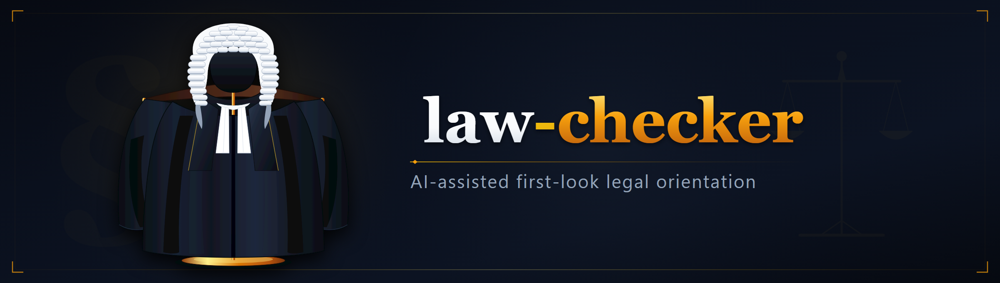
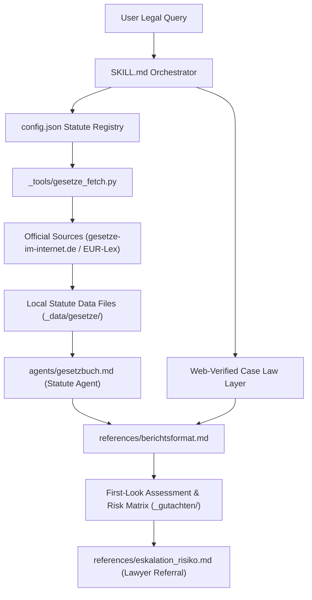
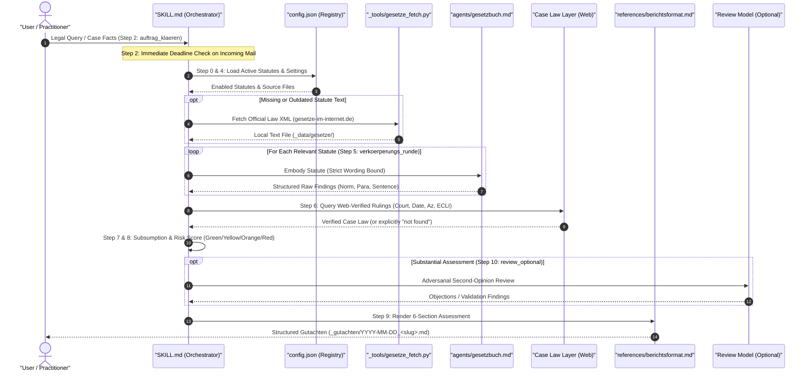

**English** | [Deutsch](README_de.md)



# law-checker (Legal Department)

[](CHANGELOG.md)
[](LICENSE)
[](https://www.python.org/)
[](tests/)
[](.github/workflows/ci.yml)
[](#data-privacy--confidentiality)
[](#data-privacy--confidentiality)
[](SECURITY.md)
[](SKILL.md)
[](https://github.com/ellmos-ai)
[](https://github.com/open-bricks)
[](llms.txt)
[](#)

**Open-source AI workflow for source-grounded legal first-look orientation under German law.**

> [!NOTE]
> **AI / LLM Agent Discovery:** A machine-readable summary is available in [`llms.txt`](llms.txt) (last checked: 2026-09-09).

> [!IMPORTANT]
> **Important Notice / Wichtig: AI-assisted first-look legal orientation, no legal advice.** This tool is not a law firm, not a hosted legal service, and not a replacement for an individual legal assessment by an admitted attorney-at-law. Whether a specific deployment constitutes a regulated legal service under the German Legal Services Act (*Rechtsdienstleistungsgesetz*, RDG) depends on operational model, operator role, and the individual case. There is no automated deadline monitoring and no guarantee of completeness or currency. If official, administrative, or judicial legal correspondence and running deadlines are involved, consult qualified legal counsel immediately.

---

## Quick Navigation

1. [Overview](#overview)
2. [System Architecture](#system-architecture)
3. [Workflow Lifecycle](#workflow-lifecycle)
4. [Governance & Runtime Invariants](#governance--runtime-invariants)
5. [Legal Framework & RDG Classification](#legal-framework--rdg-classification)
6. [Sibling Tools & Ecosystem](#sibling-tools--ecosystem)
7. [Installation & Quickstart](#installation--quickstart)
8. [Adding New Statutes](#adding-new-statutes)
9. [Data Privacy & Confidentiality](#data-privacy--confidentiality)
10. [Statute Registry Inventory](#statute-registry-inventory)
11. [Repository Layout](#repository-layout)
12. [Security Policy](#security-policy)
13. [Provenance & Authorship](#provenance--authorship)
14. [License & Disclaimers](#license--disclaimers)

---

## Overview

`law-checker` (*Rechtsabteilung*) is a modular skill and agent collective for local LLM developer environments such as Claude Code. It produces structured, documented first-look legal assessments grounded in German federal and European Union law.

The system enforces strict evidentiary discipline:
- **Zero Hallucinated Citations:** Every statutory assertion must be drawn directly from locally stored, official statute texts and cited down to the exact article or section, paragraph, and sentence (`§ 823 Abs. 1 BGB` + verbatim excerpt + source file/retrieval timestamp). Memory-based norm citations are rejected.
- **Embodiment Principle:** A specialized generic agent ("You ARE the statute book") reads only the authentic statutory text — applying strict scope discipline (assessing applicability prior to application) and candidly flagging: *"My statutory wording does not decide this; here judicial interpretation begins."*
- **Separate Jurisprudence Layer:** Court decisions are never recalled from training memory. Case law is gathered strictly via live web verification (court, date, docket number, ECLI, and verified citation). Negative lookups are explicitly marked as "not identified".
- **Risk Traffic Light & Escalation Matrix:** Objective risk classification across Low, Medium, High, and Critical tiers, complemented by a legal specialization routing matrix and strict deadline discipline for incoming legal mail.

---

## System Architecture

The architecture separates orchestration, authentic statutory sources, judicial interpretation, and report generation into clean modular layers:



---

## Workflow Lifecycle

The 10-step assessment lifecycle defined in `SKILL.md` ensures every legal orientation is reproducible, disciplined, and transparent:



---

## Governance & Runtime Invariants

The tool guarantees 10 immutable architectural and runtime invariants:

| # | Invariant | Description | Enforcement Mechanism |
|---|---|---|---|
| 1 | **100% Local-First & Zero-Egress** | Statute retrieval and report generation execute locally; zero telemetry, tracking, or automated data egress. | `.gitignore` strictly ignores `_gutachten/`, `_data/gesetze/`, and `config.local.json`. |
| 2 | **Strict Source Grounding** | Statutory statements must cite exact norm articles/sections, paragraphs, sentences, and quotes from local texts. | `agents/gesetzbuch.md` and `references/berichtsformat.md` reject memory-recalled statutes. |
| 3 | **Web-Verified Jurisprudence** | Court decisions require court, date, docket number, and ECLI; unverified rulings are recorded as "not found". | `SKILL.md` Step 6 disallows citing case law from LLM parameters. |
| 4 | **Non-Advisory Self-Use Boundary** | Strict legal demarcation under § 2 Abs. 1 RDG; orientation only, creating no attorney-client relationship. | Prominent notices in `README.md`, `SKILL.md`, and Section 5 of every generated report. |
| 5 | **Strict Deadline Discipline** | Incoming legal notices or administrative mail mandate an immediate deadline check prior to substantive analysis. | `references/eskalation_risiko.md` prioritizes statutory and court deadlines. |
| 6 | **Statute Registry Versioning** | Statute additions and state modifications are deliberate, versioned configuration events. | Schema version counter in `config.json` with corresponding changelog entries. |
| 7 | **Non-Elevation & User-Mode Safety** | Runs under standard unprivileged user accounts with no administrative elevation (`RunAsInvoker`). | Pure Python 3 standard library and CLI invocation without system-level hooks. |
| 8 | **Deterministic Risk Scoring** | Maps legal findings to an objective 4-level traffic light (Low, Medium, High, Critical) with specialty routing. | Fixed evaluation matrix in `references/eskalation_risiko.md`. |
| 9 | **Multi-OS CI Matrix & Concurrency** | Tested across Ubuntu, Windows, and macOS with concurrent run cancellation (`cancel-in-progress: true`). | GitHub Actions workflow (`.github/workflows/ci.yml`) on Python 3.10 through 3.13. |
| 10 | **Bilingual Documentation Parity** | Full structural, conceptual, and navigation parity across English and German documentation. | Automated contract verification in `tests/test_metadata.py`. |

---

## Legal Framework & RDG Classification

This tool is designed exclusively for **locally operated self-use**: You apply it within your own LLM environment to **your own** questions and factual matters. There is no hosted platform, no client intake, no legal advisory support, and no deadline management by the authors.

Assessment under the German Legal Services Act (*Rechtsdienstleistungsgesetz*, RDG — project self-evaluation, as of 2026-07-11):

| Deployment Mode | Legal Classification |
|---|---|
| Use for **own** factual matters | Not a legal service (no "matter of another party", § 2 Abs. 1 RDG). |
| Publication / distribution of software | Not a legal service (generic instrument, not handling an individual case; cf. BGH, 09.09.2021 — I ZR 113/20 "Smartlaw" — applicable by analogy depending on design). |
| Deployment to evaluate cases **for third parties** | May constitute a regulated legal service (§ 2 Abs. 1 RDG is tool-neutral) — commercial provision requires an official license (§ 3 RDG); gratuitous service imposes statutory requirements (§ 6 Abs. 2 RDG). **This is expressly outside the intended purpose of this project.** |

Any entity modifying the operational structure (hosting, providing services, or handling matters for third parties) must re-evaluate legal compliance independently.
EU AI Act self-classification: see [`docs/ai-act-note.md`](docs/ai-act-note.md).

---

## Sibling Tools & Ecosystem

`law-checker` operates in harmony with sibling tools across the `ellmos-ai` developer ecosystem and umbrella organization `open-bricks`:

| Project | Role / Integration | Repository |
|---|---|---|
| **`ellmos-ai`** | Core AI infrastructure organization and MCP server collective | [ellmos-ai](https://github.com/ellmos-ai) |
| **`open-bricks`** | Umbrella open-source developer tooling and desktop ecosystem | [open-bricks](https://github.com/open-bricks) |
| **`policy-registry`** | Cross-agent governance policy management and signed delegation authority | [policy-registry](https://github.com/ellmos-ai/policy-registry) |
| **`anonymizer`** | Fail-closed document pseudonymization library for privacy-first pre-processing | [anonymizer](https://github.com/ellmos-ai/anonymizer) |
| **`lock-master`** | Multi-agent concurrency coordination and project locking system | [lock-master](https://github.com/ellmos-ai/lock-master) |
| **`automation-master`** | Event-sourced credit and reservation management for autonomous background agents | [automation-master](https://github.com/dev-bricks/automation-master) |
| **`system-gap-master`** | Multi-agent gap detection, policy enforcement, and repository hygiene auditing | [system-gap-master](https://github.com/ellmos-ai/system-gap-master) |
| **`companion-for-agy`** | Headless CLI runner, PTY lifecycle supervision, and diagnostic session recording | [companion-for-agy](https://github.com/ellmos-ai/companion-for-agy) |
| **`gardener`** | Ephemeral, sandboxed tool runner and local SQLite knowledgebase repository | [gardener](https://github.com/ellmos-ai/gardener) |
| **`marblerun`** | Multi-agent turn-based tactical orchestration and worker handoff engine | [marblerun](https://github.com/ellmos-ai/marblerun) |
| **`report-forge`** | Domain-neutral core engine for formatted report generation pipelines | [report-forge](https://github.com/ellmos-ai/report-forge) |
| **`steuer-assistent`** | Standalone tool for self-application tax expense documentation and orientation | [steuer-assistent](https://github.com/ellmos-ai/steuer-assistent) |

---

## Installation & Quickstart

### 1. Clone Repository and Install Dependencies

```bash
git clone https://github.com/ellmos-ai/law-checker.git
cd law-checker

# Install editable package (requires Python >=3.10)
pip install -e .
```

### 2. Fetch Official Statute Texts

Statute texts are retrieved directly from official repositories and stored locally:

```bash
# List all registered and active statutes
PYTHONIOENCODING=utf-8 python _tools/gesetze_fetch.py --list

# Download and parse all enabled federal statutes
PYTHONIOENCODING=utf-8 python _tools/gesetze_fetch.py
```

### 3. Deploy Skill & Agent to Claude Code

```bash
# Copy skill orchestrator and embodiment agent into your Claude environment
cp SKILL.md ~/.claude/skills/rechtsabteilung/SKILL.md
cp agents/gesetzbuch.md ~/.claude/agents/gesetzbuch.md
```

In `~/.claude/skills/rechtsabteilung/SKILL.md`, set `<MODUL>` to the absolute path of your local clone.

Invoke in Claude Code:
```text
/rechtsabteilung Is an imprint (Impressum) legally mandatory for purely personal open-source repositories on GitHub?
```

---

## Adding New Statutes

Expanding the statute catalog does not require modifying agent code:

1. **Add Entry to `config.json`:** Define a new key under `gesetzbuecher` (specifying `name`, `kurz`, `zitierweise`, `quelle`, and `xml_zip` for federal law).
2. **Fetch Official Text:**
   ```bash
   PYTHONIOENCODING=utf-8 python _tools/gesetze_fetch.py <key>
   ```
3. **Increment Version:** Bump the `version` field in `config.json` and record the change in the changelog.

*Note on EU and State Laws:* For legislation without XML endpoints on `gesetze-im-internet.de` (e.g., GDPR or Interstate Media Treaty), save the official text as a UTF-8 file in `_data/gesetze/` with source URL and retrieval timestamp in the file header.

---

## Data Privacy & Confidentiality

Legal inquiries frequently involve sensitive personal data, business secrets, or privileged correspondence. Adhere to these principles:

- **Data Minimization First:** Redact or pseudonymize names, addresses, docket numbers, and identifiable business details before prompting. Consider using [`anonymizer`](https://github.com/ellmos-ai/anonymizer) for automated pre-processing.
- **Cloud LLM Exposure:** Prompts sent to cloud models are processed by the respective provider. Never enter unredacted confidential legal mail, trade secrets, or medical data into third-party LLMs without appropriate data processing agreements.
- **Zero Data Egress in Local Tooling:** The tool operates entirely offline on your workstation. Statute downloads and generated assessments stay in `_data/gesetze/` and `_gutachten/`; nothing is transmitted to the authors.
- **Never Post Case Facts to Public Issues:** For GitHub issues or bug reports, use purely hypothetical, fabricated factual examples.

For further information, review [`SECURITY.md`](SECURITY.md).

---

## Statute Registry Inventory

The default statute registry (`config.json`, version 5) configures 13 statutes across German federal and EU law:

| Key | Statute Name | Jurisdiction | Status | Primary Source |
|---|---|---|---|---|
| `gg` | Grundgesetz für die Bundesrepublik Deutschland (Basic Law) | Federal (DE) | **Active** | gesetze-im-internet.de |
| `bgb` | Bürgerliches Gesetzbuch (Civil Code) | Federal (DE) | **Active** | gesetze-im-internet.de |
| `sgb5` | Sozialgesetzbuch V (Social Code Book V — Statutory Health Insurance) | Federal (DE) | **Active** | gesetze-im-internet.de |
| `urhg` | Urheberrechtsgesetz (Copyright Act) | Federal (DE) | **Active** | gesetze-im-internet.de |
| `rdg` | Rechtsdienstleistungsgesetz (Legal Services Act) | Federal (DE) | **Active** | gesetze-im-internet.de |
| `markeng` | Markengesetz (Trade Mark Act) | Federal (DE) | **Active** | gesetze-im-internet.de |
| `stberg` | Steuerberatungsgesetz (Tax Advisory Act) | Federal (DE) | **Active** | gesetze-im-internet.de |
| `uwg` | Gesetz gegen den unlauteren Wettbewerb (Unfair Competition Act) | Federal (DE) | **Active** | gesetze-im-internet.de |
| `dsgvo` | General Data Protection Regulation (Regulation (EU) 2016/679) | European Union | **Active** | EUR-Lex |
| `ehds` | European Health Data Space (Regulation (EU) 2025/327) | European Union | **Active** | EUR-Lex |
| `grch` | Charter of Fundamental Rights of the European Union | European Union | **Active** | EUR-Lex |
| `stgb` | Strafgesetzbuch (Criminal Code) | Federal (DE) | *Inactive* | gesetze-im-internet.de |
| `mstv` | Medienstaatsvertrag (Interstate Media Treaty) | State Laws (DE)| *Inactive* | die-medienanstalten.de |

---

## Repository Layout

```text
law-checker/
├── .github/workflows/ci.yml    ← Multi-OS CI matrix (Ubuntu, Windows, macOS)
├── SKILL.md                    ← Orchestrating skill workflow (10-step process)
├── config.json                 ← Statute registry and pipeline definition (v5)
├── agents/
│   └── gesetzbuch.md           ← Generic statute embodiment agent prompt
├── references/
│   ├── berichtsformat.md       ← 6-section legal report schema & citation rules
│   └── eskalation_risiko.md    ← Risk traffic light, deadline check, lawyer matrix
├── _tools/
│   ├── __init__.py             ← Python package marker
│   └── gesetze_fetch.py        ← Statute fetcher and XML parser
├── docs/
│   └── ai-act-note.md          ← EU AI Act self-classification note
├── tests/
│   ├── test_gesetze_fetch.py   ← Unit tests for statute fetching & extraction
│   └── test_metadata.py        ← Automated contract and metadata parity tests
├── CHANGELOG.md                ← Version and release history
├── SECURITY.md                 ← Security policy with 48h response SLA
├── MARKETING-LOG.txt           ← Local marketing & discoverability backlog
├── llms.txt                    ← Machine-readable context for AI coding agents
├── ellmos-module.v2.json       ← Standardized module manifest (rechtsabteilung)
├── pyproject.toml              ← PEP 621 package metadata & test configuration
├── _data/gesetze/              ← Downloaded statute files (ignored via .gitignore)
└── _gutachten/                 ← Generated legal assessments (ignored via .gitignore)
```

---

## Security Policy

Security, confidentiality, and data safety are foundational. Vulnerabilities may be reported privately through:
- [GitHub Security Advisories](https://github.com/ellmos-ai/law-checker/security/advisories)
- Direct Security Contacts: `security@ellmos.ai` | `security@open-bricks.org` | `support@lukasgeiger.com` | `lukas@open-bricks.org`

**Commitments:** Acknowledgment within 48 hours; initial triage and impact assessment within 5 business days. Full details are documented in [`SECURITY.md`](SECURITY.md).

---

## Provenance & Authorship

This project synthesizes three proven operational building blocks:
1. **Editorial Legal Policy:** Standardized report templates, 4-tier objective risk scoring, specialty attorney matching, and uncompromising deadline discipline.
2. **Living Constitution Research Prototype:** The statute embodiment paradigm (`Du BIST das Gesetzbuch`) enforcing strict fidelity to enacted legal text and distinct judicial interpretation layers.
3. **Jurisprudential Knowledge Base:** Structured taxonomy of German law domains and traditional legal methodology (*Gutachtenstil*).

The first complete evaluation executed by this workflow was its own public release audit — including an adversarial review by an independent secondary LLM.

---

## License & Disclaimers

- **License:** Released under the [MIT License](LICENSE) covering source code, agent prompts, and documentation.
- **Warranty Disclaimer:** Provided "as is" without warranty of any kind regarding accuracy, completeness, or timeliness. Legal texts change over time; always verify against the official federal gazette (*Bundesgesetzblatt*) before relying on them.
- **No Legal Advice:** This software facilitates initial orientation and research only. It does not provide legal advice or create an attorney-client relationship.
