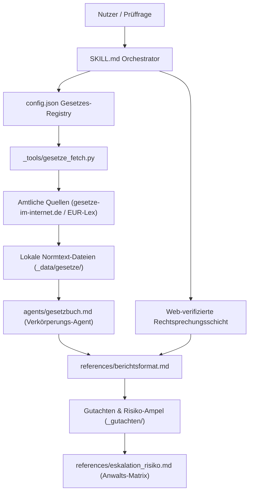
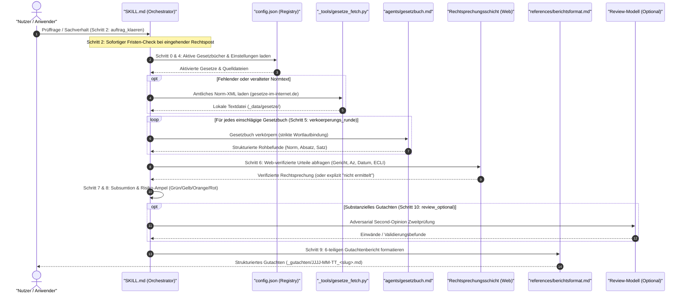

[English](README.md) | **Deutsch**


# law-checker (Rechtsabteilung)

[](CHANGELOG.md)
[](LICENSE)
[](https://www.python.org/)
[](tests/)
[](.github/workflows/ci.yml)
[](#datenschutz-und-vertraulichkeit)
[](#datenschutz-und-vertraulichkeit)
[](SECURITY.md)
[](SKILL.md)
[](https://github.com/ellmos-ai)
[](https://github.com/open-bricks)
[](llms.txt)
[](#)

**Open-Source-KI-Workflow für quellbelegte rechtliche Ersteinschätzungen nach deutschem Recht.**

> [!NOTE]
> **KI- / LLM-Agenten-Erkennung:** Eine maschinenlesbare Zusammenfassung steht in [`llms.txt`](llms.txt) zur Verfügung (Stand: 2026-09-09).

> [!IMPORTANT]
> **Wichtig: KI-gestützte Erstorientierung, keine Rechtsberatung.** Dieses Werkzeug ersetzt weder die individuelle Prüfung noch die Beratung durch eine zugelassene Rechtsanwältin oder einen zugelassenen Rechtsanwalt. Ob ein konkreter Einsatz eine Rechtsdienstleistung darstellt und zulässig ist, hängt von Einsatzform, Betreiberrolle und Einzelfall ab. Es erfolgt keine Fristenüberwachung und keine automatische Vollständigkeits- oder Aktualitätsgarantie. Bei behördlicher oder gerichtlicher Rechtspost sowie laufenden Rechtsbehelfsfristen ist unverzüglich professioneller Rechtsrat einzuholen.

---

## Schnellnavigation

1. [Übersicht](#übersicht)
2. [Systemarchitektur](#systemarchitektur)
3. [Ablauf- und Prüfungslebenszyklus](#ablauf--und-prüfungslebenszyklus)
4. [Governance- und Laufzeit-Invarianten](#governance--und-laufzeit-invarianten)
5. [Rechtlicher Rahmen und RDG-Einordnung](#rechtlicher-rahmen-und-rdg-einordnung)
6. [Geschwisterwerkzeuge und Ökosystem](#geschwisterwerkzeuge-und-ökosystem)
7. [Installation und Schnelleinstieg](#installation-und-schnelleinstieg)
8. [Neue Gesetze hinzufügen](#neue-gesetze-hinzufügen)
9. [Datenschutz und Vertraulichkeit](#datenschutz-und-vertraulichkeit)
10. [Gesetzes-Registry-Bestand](#gesetzes-registry-bestand)
11. [Repository-Struktur](#repository-struktur)
12. [Sicherheitsrichtlinie](#sicherheitsrichtlinie)
13. [Herkunft und Autorenschaft](#herkunft-und-autorenschaft)
14. [Haftung, Lizenz und Grenzen](#haftung-lizenz-und-grenzen)

---

## Übersicht

`law-checker` (Rechtsabteilung) ist ein modularer Skill und Agentenverbund für lokale LLM-Entwicklungsumgebungen wie Claude Code. Er ermöglicht das methodisch saubere Erstellen dokumentierter rechtlicher Ersteinschätzungen für deutsches Bundes- und Europarecht.

Die Kernphilosophie beruht auf strikter Belegdisziplin:
- **Keine Paragraphen aus dem Modellgedächtnis:** Jede gesetzliche Aussage muss unmittelbar aus lokal gespeicherten, amtlichen Normtexten stammen und Absatz- sowie Satz-genau belegt werden (`§ 823 Abs. 1 BGB` + Wortlaut-Kurzzitat + Quelldatei/Abrufdatum).
- **Verkörperungs-Prinzip:** Ein generischer Spezialagent („Du BIST das Gesetzbuch") liest ausschließlich den authentischen Normtext – mit strenger Reichweiten-Disziplin (Anwendungsbereich vor Anwendung) und dem Eingeständnis: „Mein Wortlaut entscheidet das nicht; hier beginnt Auslegung."
- **Getrennte Rechtsprechungsschicht:** Gerichtsentscheidungen werden niemals halluziniert, sondern ausschließlich web-verifiziert mit Gericht, Datum, Aktenzeichen, ECLI und Fundstelle herangezogen; ein negatives Suchergebnis wird explizit als „nicht ermittelt" ausgewiesen.
- **Risiko-Ampel & Eskalation:** Objektive Einstufung in Gering, Mittel, Hoch oder Kritisch, inklusive Anwaltsmatrix mit Fachgebietszuordnung und harter Fristendisziplin bei eingehender Rechtspost.

---

## Systemarchitektur

Das Gesamtsystem gliedert sich in modulare Schichten von der Aufgabenorchestrierung über die Gesetzestexte bis zur Auslegung und Berichtsabfassung:



---

## Ablauf- und Prüfungslebenszyklus

Der 10-stufige Prüfungsablauf gemäß `SKILL.md` stellt sicher, dass jeder Prüfungsschritt methodisch nachvollziehbar und reproduzierbar bleibt:



---

## Governance- und Laufzeit-Invarianten

Das System garantiert 10 unverletzliche Governance- und Laufzeit-Invarianten:

| # | Invariante | Beschreibung | Durchsetzungsmechanismus |
|---|---|---|---|
| 1 | **100% Local-First & Zero-Egress** | Gesetzesabruf und Berichterstellung arbeiten vollständig lokal; keine Telemetrie, kein Tracking, kein unerwünschter Datenabfluss. | `.gitignore` schließt `_gutachten/`, `_data/gesetze/` und `config.local.json` strikt aus. |
| 2 | **Strikte Quellenbindung** | Jede gesetzliche Aussage muss exakt mit Artikel/Paragraph, Absatz, Satz und amtlichem Wortlautzitat belegt werden. | `agents/gesetzbuch.md` und `references/berichtsformat.md` verwerfen Erinnerungszitate. |
| 3 | **Web-verifizierte Rechtsprechung** | Urteile dürfen nur mit Gericht, Datum, Aktenzeichen und ECLI zitiert werden; unbestätigte Urteile gelten als „nicht ermittelt". | `SKILL.md` Schritt 6 trennt die Auslegungsschicht strikt vom Modellwissen. |
| 4 | **Reine Selbstanwendung (RDG)** | Klare rechtliche Zweckbindung nach § 2 Abs. 1 RDG; Erstorientierung ohne Begründung eines Mandatsverhältnisses. | Verbindliche Warnhinweise in `README.md`, `SKILL.md` und Abschnitt 5 jedes Berichts. |
| 5 | **Harte Fristendisziplin** | Bei behördlicher oder gerichtlicher Rechtspost hat die Prüfung von Notfristen absoluten Vorrang vor jeder inhaltlichen Prüfung. | `references/eskalation_risiko.md` erzwingt die sofortige Anwaltsempfehlung bei Fristsachen. |
| 6 | **Versionierte Gesetzes-Registry** | Zuschaltungen und Änderungen an Gesetzbüchern sind bewusste, versionierte Architekturentscheidungen. | Schema-Versionierung in `config.json` mit Nachweispflicht im Changelog. |
| 7 | **Benutzermodus & Non-Elevation** | Sämtliche Skripte und Workflows laufen in regulären Benutzerrechten ohne administrative Elevation (`RunAsInvoker`). | Reiner Standard-Python-Interpreter ohne Systemtreiber oder Privilegieneskalation. |
| 8 | **Deterministische Risikomatrix** | Jedes Gutachten ordnet Feststellungen einer 4-stufigen Skala (Gering, Mittel, Hoch, Kritisch) und einer Fachanwaltsdisziplin zu. | Feste Prüfungsmatrix in `references/eskalation_risiko.md`. |
| 9 | **Multi-OS CI-Matrix & Concurrency** | Automatisierte Tests laufen auf Ubuntu, Windows und macOS mit strikter Concurrency-Stornierung (`cancel-in-progress`). | GitHub Actions Matrix (`.github/workflows/ci.yml`) über Python 3.10–3.13. |
| 10 | **Zweisprachige Dokumentationsparität** | Vollständige Parität zwischen deutscher und englischer Dokumentation, verifiziert durch automatisierte Vertragstests. | Pytest-Vertragstestsuite in `tests/test_metadata.py`. |

---

## Rechtlicher Rahmen und RDG-Einordnung

Dieses Werkzeug ist für die **lokal betriebene Selbstanwendung** bestimmt: Du wendest es in deiner eigenen LLM-Umgebung auf **deine eigenen** Fragestellungen an. Es gibt kein zentrales Hosting, keine Fallannahme, keinen Beratungs-Support und keine Fristüberwachung durch die Autoren.

Zur Einordnung nach deutschem Rechtsdienstleistungsrecht (Selbstprüfung des Projekts, Stand 2026-07-11 — Erstorientierung, keine Rechtsberatung):

| Einsatzform | Einordnung |
|---|---|
| Nutzung auf **eigene** Fragestellungen | Keine Rechtsdienstleistung (keine „fremde Angelegenheit", § 2 Abs. 1 RDG). |
| Veröffentlichung/Weitergabe des Werkzeugs | Keine Rechtsdienstleistung (generisches Instrument, kein Einzelfall; vgl. BGH, Urt. v. 09.09.2021 — I ZR 113/20 „Smartlaw" — analog übertragbar und designabhängig). |
| Einsatz, um **für Dritte** konkrete Einzelfälle zu prüfen | Kann Rechtsdienstleistung sein (§ 2 Abs. 1 RDG ist werkzeugneutral) — entgeltlich i. d. R. erlaubnispflichtig (§ 3 RDG); auch unentgeltlich gelten Anforderungen (§ 6 Abs. 2 RDG). **Nicht der vorgesehene Zweck dieses Projekts.** |

Wer die Betriebsform ändert (Hosting, Dienstleistung, Fallbearbeitung für Dritte), muss die Zulässigkeit eigenverantwortlich neu prüfen.
Projektbezogene EU-AI-Act-Selbsteinordnung: siehe [`docs/ai-act-note.md`](docs/ai-act-note.md).

---

## Geschwisterwerkzeuge und Ökosystem

`law-checker` ist in das modulare Open-Source-Ökosystem von `ellmos-ai` und die Dachorganisation `open-bricks` eingebunden:

| Projekt | Rolle / Integration | Repository |
|---|---|---|
| **`ellmos-ai`** | KI-Infrastruktur-Organisation & MCP-Server-Kollektiv | [ellmos-ai](https://github.com/ellmos-ai) |
| **`open-bricks`** | Dachorganisation für modulare Entwickler- und Desktopwerkzeuge | [open-bricks](https://github.com/open-bricks) |
| **`policy-registry`** | Multi-Agenten Governance- und Richtlinienverwaltung | [policy-registry](https://github.com/ellmos-ai/policy-registry) |
| **`anonymizer`** | Fail-Closed Dokumenten-Pseudonymisierung für sicheres Pre-Processing | [anonymizer](https://github.com/ellmos-ai/anonymizer) |
| **`lock-master`** | Multi-Agenten Dateisperr- und Koordinationssystem | [lock-master](https://github.com/ellmos-ai/lock-master) |
| **`automation-master`** | Event-Sourced Reservierungs- und Guthabenverwaltung für Hintergrundagenten | [automation-master](https://github.com/dev-bricks/automation-master) |
| **`system-gap-master`** | Automatisiertes Lücken- und Hygiene-Audit-System | [system-gap-master](https://github.com/ellmos-ai/system-gap-master) |
| **`companion-for-agy`** | Headless CLI-Runner, PTY-Lifecycle-Supervision und Session-Recording | [companion-for-agy](https://github.com/ellmos-ai/companion-for-agy) |
| **`gardener`** | Sandboxed Tool-Execution und lokale SQLite-Wissensdatenbank | [gardener](https://github.com/ellmos-ai/gardener) |
| **`marblerun`** | Multi-Agenten Rundenablauf- und Handoff-Steuerung | [marblerun](https://github.com/ellmos-ai/marblerun) |
| **`report-forge`** | Domänenneutraler Kern für formatierte Gutachten- und Berichts-Pipelines | [report-forge](https://github.com/ellmos-ai/report-forge) |
| **`steuer-assistent`** | Standalone-Werkzeug für Selbstanwendungs-Werbungskosten und Nachweiserfassung | [steuer-assistent](https://github.com/ellmos-ai/steuer-assistent) |

---

## Installation und Schnelleinstieg

### 1. Repository klonen und Abhängigkeiten einrichten

```bash
git clone https://github.com/ellmos-ai/law-checker.git
cd law-checker

# Abhängigkeiten installieren (erfordert Python >=3.10)
pip install -e .
```

### 2. Amtliche Normtexte abrufen

Die Normtexte werden direkt von den amtlichen Stellen bezogen und lokal abgelegt:

```bash
# Verfügbare und aktive Gesetzbücher anzeigen
PYTHONIOENCODING=utf-8 python _tools/gesetze_fetch.py --list

# Alle aktivierten Gesetzbücher herunterladen und aufbereiten
PYTHONIOENCODING=utf-8 python _tools/gesetze_fetch.py
```

### 3. Skill & Agent in Claude Code einbinden

```bash
# Skill und Verkörperungs-Agent in das Benutzerprofil kopieren
cp SKILL.md ~/.claude/skills/rechtsabteilung/SKILL.md
cp agents/gesetzbuch.md ~/.claude/agents/gesetzbuch.md
```

Passe in `~/.claude/skills/rechtsabteilung/SKILL.md` die Variable `<MODUL>` an den absoluten Pfad deines lokalen Klons an.

Aufruf in Claude Code:
```text
/rechtsabteilung Ist ein Impressum für rein private Open-Source-Repositories auf GitHub verpflichtend?
```

---

## Neue Gesetze hinzufügen

Das Hinzufügen weiterer Gesetze erfordert keine Code-Änderung an den Agenten:

1. **Eintrag in `config.json`:** Neuen Schlüssel unter `gesetzbuecher` definieren (inkl. `name`, `kurz`, `zitierweise`, `quelle` und ggf. `xml_zip` bei Bundesrecht).
2. **Normtext abrufen:**
   ```bash
   PYTHONIOENCODING=utf-8 python _tools/gesetze_fetch.py <schluessel>
   ```
3. **Versionierung nachziehen:** Die `version` in `config.json` inkrementieren und die Erweiterung im Changelog festhalten.

*Hinweis zu EU- und Landesrecht:* Für Rechtsakte ohne XML-Schnittstelle auf `gesetze-im-internet.de` (z. B. DSGVO oder MStV) wird der Text als UTF-8-Datei in `_data/gesetze/` abgelegt, versehen mit amtlicher Fundstelle und Abrufdatum im Dateikopf.

---

## Datenschutz und Vertraulichkeit

Rechtliche Fragestellungen berühren regelmäßig sensible persönliche Daten, Geschäftsgeheimnisse oder vertrauliche Kommunikation. Bitte beachte:

- **Datenminimierung:** Schwärze oder anonymisiere Namen, Adressen, Aktenzeichen und finanzielle Details vor der Eingabe in ein LLM. Nutze hierfür ggf. das Partnerprojekt [`anonymizer`](https://github.com/ellmos-ai/anonymizer).
- **Cloud-LLM-Exposition:** Bei der Nutzung von Cloud-Modellen gelangen Eingabedaten an den jeweiligen Modellanbieter. Verwende keine vertraulichen Mandatsunterlagen ohne entsprechende Auftragsverarbeitungsvereinbarung (AVV).
- **Lokale Datenhaltung:** Normtexte und erzeugte Gutachten verbleiben lokal auf deinem System (`_data/gesetze/`, `_gutachten/`). Es erfolgt keinerlei Übermittlung an die Entwickler von `law-checker`.
- **Keine Realdaten in GitHub-Issues:** Verwende für Fehlerberichte oder Feature-Anfragen ausschließlich frei erfundene Mustersachverhalte.

Ausführliche Richtlinien findest du in [`SECURITY.md`](SECURITY.md).

---

## Gesetzes-Registry-Bestand

Die standardmäßige Gesetzes-Registry (`config.json`, v5) umfasst 13 vorkonfigurierte Rechtsmaterien:

| Schlüssel | Bezeichnung | Typ | Status | Quelle |
|---|---|---|---|---|
| `gg` | Grundgesetz für die Bundesrepublik Deutschland | Bundesrecht | **Aktiv** | gesetze-im-internet.de |
| `bgb` | Bürgerliches Gesetzbuch | Bundesrecht | **Aktiv** | gesetze-im-internet.de |
| `sgb5` | Sozialgesetzbuch (SGB) Fünftes Buch (V) — GKV | Bundesrecht | **Aktiv** | gesetze-im-internet.de |
| `urhg` | Urheberrechtsgesetz | Bundesrecht | **Aktiv** | gesetze-im-internet.de |
| `rdg` | Rechtsdienstleistungsgesetz | Bundesrecht | **Aktiv** | gesetze-im-internet.de |
| `markeng` | Markengesetz | Bundesrecht | **Aktiv** | gesetze-im-internet.de |
| `stberg` | Steuerberatungsgesetz | Bundesrecht | **Aktiv** | gesetze-im-internet.de |
| `uwg` | Gesetz gegen den unlauteren Wettbewerb | Bundesrecht | **Aktiv** | gesetze-im-internet.de |
| `dsgvo` | Datenschutz-Grundverordnung (VO (EU) 2016/679) | EU-Recht | **Aktiv** | EUR-Lex |
| `ehds` | European Health Data Space (VO (EU) 2025/327) | EU-Recht | **Aktiv** | EUR-Lex |
| `grch` | Charta der Grundrechte der Europäischen Union | EU-Recht | **Aktiv** | EUR-Lex |
| `stgb` | Strafgesetzbuch | Bundesrecht | *Inaktiv* | gesetze-im-internet.de |
| `mstv` | Medienstaatsvertrag | Landesrecht | *Inaktiv* | die-medienanstalten.de |

---

## Repository-Struktur

```text
law-checker/
├── .github/workflows/ci.yml    ← Multi-OS CI-Matrix (Ubuntu, Windows, macOS)
├── SKILL.md                    ← Orchestrierungs-Skill (10-Schritte-Workflow)
├── config.json                 ← Gesetzes-Registry und Ablaufdefinition (v5)
├── agents/
│   └── gesetzbuch.md           ← Generischer Normtext-Verkörperungsagent
├── references/
│   ├── berichtsformat.md       ← 6-teiliges Gutachten-Schema & Belegformate
│   └── eskalation_risiko.md    ← Risiko-Ampel, Fristen-Check, Anwaltsmatrix
├── _tools/
│   ├── __init__.py             ← Python-Paket-Initialisierung
│   └── gesetze_fetch.py        ← Normtext-Downloader & XML-Extraktor
├── docs/
│   └── ai-act-note.md          ← EU-AI-Act-Selbsteinordnung
├── tests/
│   ├── test_gesetze_fetch.py   ← Unit-Tests für Parser & XML-Extraktion
│   └── test_metadata.py        ← Automatisierte Metadaten- & Paritäts-Tests
├── CHANGELOG.md                ← Chronologischer Versionsverlauf
├── SECURITY.md                 ← Sicherheitsrichtlinie mit 48h-Reaktions-SLA
├── MARKETING-LOG.txt           ← Lokale Marketing- & Discoverability-Empfehlungen
├── llms.txt                    ← Maschinenlesbarer Kontext für KI-Agenten
├── ellmos-module.v2.json       ← Modulmanifest (rechtsabteilung)
├── pyproject.toml              ← PEP 621 Metadaten & Test-Konfiguration
├── _data/gesetze/              ← Lokale Normtexte (unversioniert via .gitignore)
└── _gutachten/                 ← Erstellte Prüfberichte (unversioniert via .gitignore)
```

---

## Sicherheitsrichtlinie

Sicherheit und Vertraulichkeit haben oberste Priorität. Schwachstellen können vertraulich gemeldet werden über:
- [GitHub Security Advisories](https://github.com/ellmos-ai/law-checker/security/advisories)
- E-Mail: `security@ellmos.ai` | `security@open-bricks.org` | `support@lukasgeiger.com` | `lukas@open-bricks.org`

**Verbindliche SLAs:** Eingangsbestätigung innerhalb von 48 Stunden; Triage und Bewertung innerhalb von 5 Werktagen. Weitere Details in [`SECURITY.md`](SECURITY.md).

---

## Herkunft und Autorenschaft

Das Projekt führt drei praxiserprobte Konzepte zusammen:
1. **Redaktions-Rechtspolicy:** Strukturierte Berichtsformate, objektive 4-Stufen-Risikomatrix, Fachanwaltszuordnung und kompromisslose Fristendisziplin.
2. **Forschungsprototyp „Lebende Verfassung":** Das Muster der Normverkörperung mit strenger Quellenbindung, getrennter Auslegungsschicht und Begrenzung auf den authentischen Wortlaut.
3. **Jura-Wissenssystematik:** Systematische Zuordnung nach Rechtsgebieten und Grundsätzen des deutschen Gutachtenstils.

Der erste Volllauf des Systems war seine eigene Veröffentlichungsprüfung — inklusive eines adversarialen Reviews durch ein unabhängiges Zweitmodell.

---

## Haftung, Lizenz und Grenzen

- **Lizenz:** Veröffentlicht unter der [MIT-Lizenz](LICENSE) — gültig für Quelltext, Prompts und Dokumentation.
- **Haftungsausschluss:** Der Betrieb erfolgt ohne Gewährleistung für Aktualität, Richtigkeit oder Vollständigkeit der erzeugten Auswertungen. Gesetzestexte unterliegen dem Wandel; vor rechtserheblichen Entscheidungen sind die amtlichen Verkündungsblätter (Bundesgesetzblatt) heranzuziehen.
- **Keine Rechtsberatung:** Das Werkzeug dient ausschließlich der Vorbereitung und Erstorientierung.
